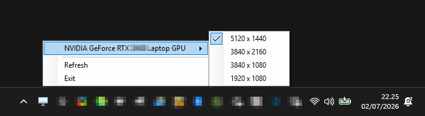

# AppChangeResolutionOnWindows

Tray utility for Windows 10/11 that lets you change monitor resolution quickly.

## Features

- Runs in the system tray
- Left-click or right-click to open the menu
- Shows available resolutions per monitor
- Marks current resolution with a checkmark
- Supports multiple monitors
- Teams meeting detection trigger for quick popup

## Screenshot

## Download

- 
